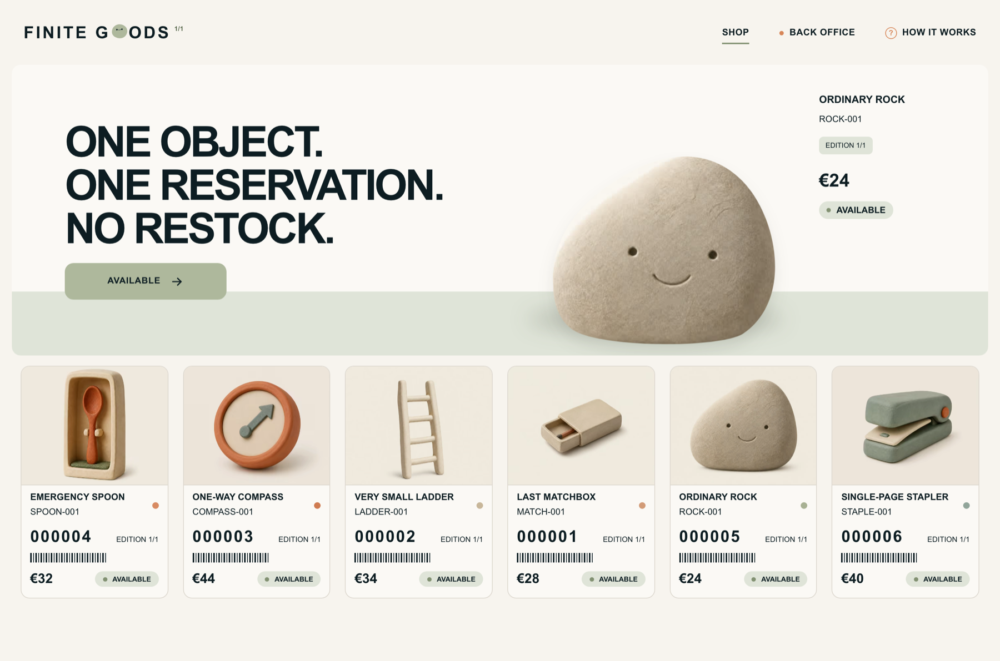
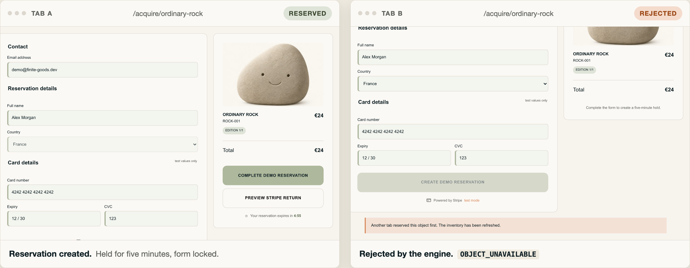
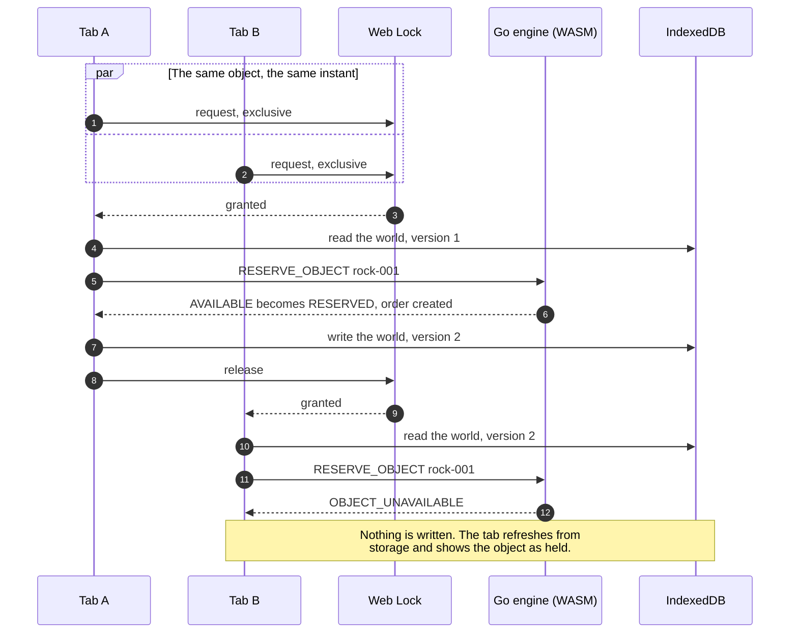
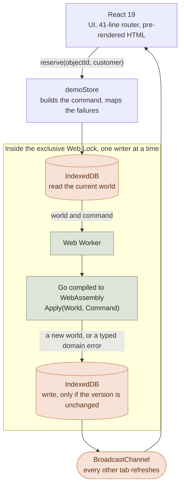
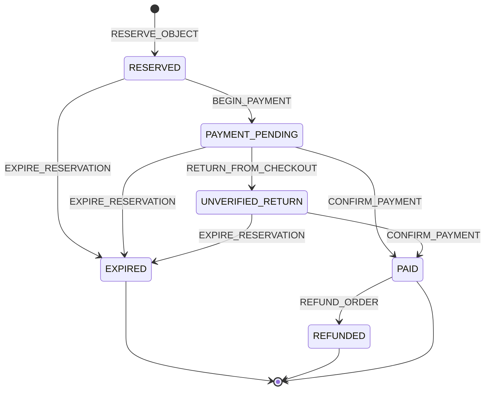
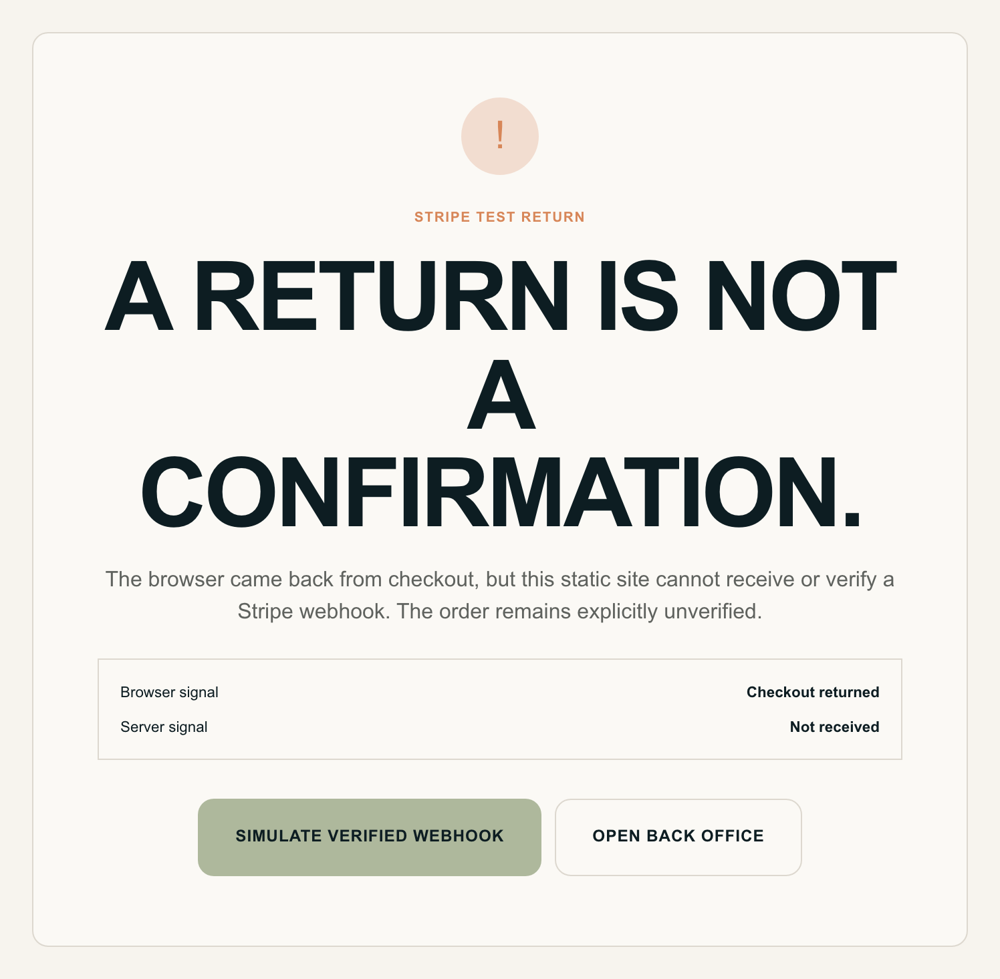
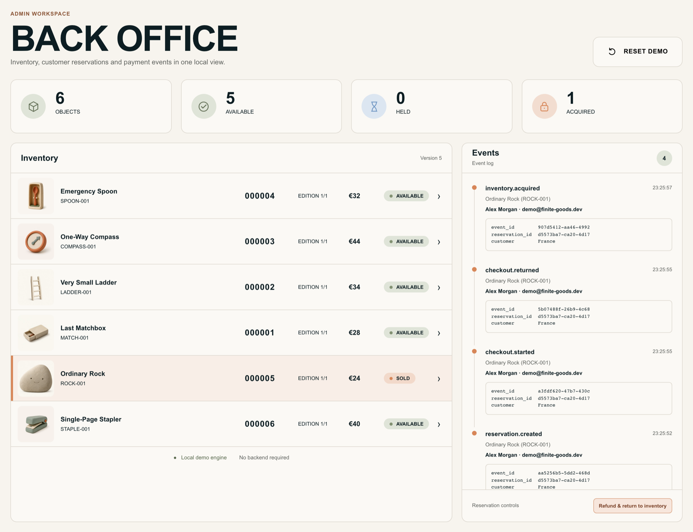

<div align="center">

<h1>Finite Goods</h1>

**Six objects. Each one exists exactly once. No server enforces it.**<br>
React 19 · Go 1.26 compiled to WebAssembly · IndexedDB · Web Locks — one static bundle on GitHub Pages.

**[Open the live demo →](https://antoinepoisson.github.io/Finite-Goods/)**

[](https://github.com/AntoinePoisson/Finite-Goods/actions/workflows/ci.yml)
[](LICENSE)

[](#measured-not-claimed)
[](#measured-not-claimed)
[](#measured-not-claimed)
[](#measured-not-claimed)

[](https://react.dev)
[](https://go.dev)
[](https://webassembly.org)
[](https://www.typescriptlang.org)
[](https://vite.dev)



</div>

## The one hard rule

Every object in the catalogue is edition 1/1. Selling the same one twice is the failure this project
exists to prevent — and it is a concurrency problem, not a UI problem. A normal shop settles it with
a transaction and a unique constraint in a database.

There is no database here. No API, no Lambda, no edge function: the whole shop is a static bundle
served by GitHub Pages. So the interesting question is what you have left to enforce an invariant
with when the only runtime you get is the browser.

The answer this project commits to: **a pure state machine written in Go, a Web Lock to serialise
writers, and an optimistic version check as the fallback.** The domain never runs in TypeScript.

## One object, two tabs

Open the same object twice and reserve it in both. One reservation is created. The other is refused
by the engine — not by a disabled button, not by a debounce, by a domain rule that returns
`OBJECT_UNAVAILABLE` and refuses to write.



<div align="center"><em>Both clicks landed inside the same millisecond. Exactly one of them changed the world.</em></div>



Three mechanisms carry that guarantee, and each one covers a different failure:

- **A Web Lock serialises the writers.** `navigator.locks.request('finite-goods:world', { mode: 'exclusive' })`
  wraps the whole read → decide → write sequence, so two tabs cannot interleave inside it.
- **An optimistic version check catches what the lock cannot.** The write re-reads the stored world
  inside the IndexedDB transaction and aborts it unless the version is still the one that was read.
  That is what protects the demo in a browser without Web Locks, and it is also the guard against a
  lock that was never held in the first place.
- **Event IDs make retries harmless.** Every command carries a UUID. The engine ignores a command
  whose event ID it has already recorded, so a replayed webhook — or a double-click, or a retry
  after a refresh — cannot sell an object twice.

The losing tab then hears about it without polling: `BroadcastChannel` announces the change, and a
`localStorage` write is the fallback for browsers that ignore it.

## How a reservation travels



TypeScript orchestrates. It never decides. Everything green is Go; the orange nodes and the boxed
critical section are browser primitives doing the job a server usually does.

## The order lifecycle

Six commands, six order states, and one rule that governs all of them: only a verified payment event
may turn held inventory into sold inventory.



The object follows along, and its status is the part a customer actually sees:

| Order reaches                           | The object becomes | Because                                              |
| --------------------------------------- | ------------------ | ---------------------------------------------------- |
| `RESERVED`                              | `RESERVED`         | a five-minute hold, exclusive to one order           |
| `PAYMENT_PENDING` · `UNVERIFIED_RETURN` | `RESERVED`         | still held — neither state proves anything was paid  |
| `PAID`                                  | `SOLD`             | the only transition that consumes the object         |
| `EXPIRED` · `REFUNDED`                  | `AVAILABLE`        | the hold is released and the object returns to stock |

A late `CONFIRM_PAYMENT` is rejected rather than honoured: if the hold elapsed, the command comes
back as `RESERVATION_EXPIRED` and the object stays available for whoever asks next.

## A return is not a confirmation

The checkout leaves for a Stripe Payment Link in test mode and comes back. That redirect is
user-controlled — anyone can type the return URL — so this demo treats it as what it is: a browser
signal, and nothing more.



The order lands in an explicit `UNVERIFIED_RETURN` state and the object stays _held_, never _sold_.
Only `CONFIRM_PAYMENT` — the path a real webhook consumer would own — is allowed to consume
inventory, and the demo makes you press that button yourself so the boundary stays visible.

A static site cannot receive a webhook. Rather than hide that, the interface states it.

## Everything is an event

The back office is not a mock screen: it reads the same world the shop writes to, and shows the
append-only event log with the identifiers that make the whole thing replay-safe.



`Version 5` in the inventory header is the optimistic-concurrency counter — the same number the write
path compares against before it commits.

## Measured, not claimed

Lighthouse 12.6 via `@lhci/cli`, median of three runs, against the production build served by
`pnpm preview`. Both profiles are asserted at `minScore: 1` in CI, so a regression fails the
pipeline instead of being noticed later.

|                        | Performance | Accessibility | Best practices | SEO     |
| ---------------------- | ----------- | ------------- | -------------- | ------- |
| **Desktop**            | **100**     | **100**       | **100**        | **100** |
| **Mobile (throttled)** | **100**     | **100**       | **100**        | **100** |

Desktop: FCP 0.3 s · LCP 0.4 s · TBT 0 ms · CLS 0.
Throttled mobile: FCP 1.1 s · LCP 1.7 s · TBT 0 ms · CLS 0.

**What the browser actually downloads**, gzipped, as GitHub Pages serves it:

| Request                                                                 | On the wire | When                                   |
| ----------------------------------------------------------------------- | ----------- | -------------------------------------- |
| `index.html` — pre-rendered homepage with the entire stylesheet inlined | **9.8 kB**  | first paint, and it needs nothing else |
| `index-*.js` — React and the whole application                          | ~70 kB      | after the copy is already on screen    |
| `engine.wasm` — the Go domain engine                                    | ~980 kB     | on the **first command**, never before |

The engine is 3.4 MB uncompressed. It is also the single most expensive thing in the project, which
is exactly why nothing on the critical path touches it — see [Things worth knowing](#things-worth-knowing).

**Timings**, Chromium against the local production build, median of three runs (`pnpm benchmark`):

| Path                                                                            | Time        |
| ------------------------------------------------------------------------------- | ----------- |
| First command — worker start, 3.4 MB module instantiated, then `RESERVE_OBJECT` | **~900 ms** |
| Two further commands on the warm worker — lock → read → engine → write, twice   | **~40 ms**  |
| Homepage first contentful paint, unthrottled                                    | **44 ms**   |

**Bundle budgets**, enforced by `size-limit` in CI on the built output:

| Asset              | Brotlied | Budget |
| ------------------ | -------- | ------ |
| Initial JavaScript | 61.65 kB | 130 kB |
| Styles             | 6.82 kB  | 12 kB  |

Reproduce any of it:

```sh
pnpm build && pnpm lighthouse          # mobile; lighthouse:desktop for the other profile
pnpm benchmark                         # the three timings above, median of three runs
pnpm size                              # the budgets
```

## Run it

Needs Node.js 24, pnpm 10 and Go 1.26.

```sh
pnpm install     # also installs the git hooks
pnpm dev         # localhost:3000 — compiles the Go engine to WebAssembly first
```

```sh
pnpm check       # lint · types · dead code · unit tests · go test -race · production build
pnpm e2e         # Playwright, five browser projects
```

Touching only the engine? `pnpm wasm` rebuilds it on its own, and `pnpm test:go` runs the domain
tests with the race detector.

Do not ship `vite build` alone. The build chain pre-renders the homepage, writes an HTML shell for
every route, inlines the stylesheet, emits `404.html`, `robots.txt` and `.nojekyll`, then asserts the
output is complete — `scripts/postbuild.mjs` and `scripts/check-build.mjs` do that work.

### Stripe preview

Set `VITE_STRIPE_PAYMENT_LINK` to a Stripe Payment Link in test mode and the checkout leaves for the
real hosted page. Without it, the local return page demonstrates the same trust boundary. Either way
no real payment is processed and nothing is stored outside the browser.

## What's inside

| Area           | Implementation                                                                    |
| -------------- | --------------------------------------------------------------------------------- |
| Domain engine  | Go 1.26 → WebAssembly, **zero dependencies**, 413 lines, hosted in a Web Worker   |
| Interface      | React 19 + TypeScript 5.9, no UI framework, no state library, a 41-line router    |
| Durability     | IndexedDB with an optimistic version check on every write                         |
| Concurrency    | Web Locks API, with the version check as the fallback                             |
| Cross-tab sync | BroadcastChannel, with a `storage` event fallback                                 |
| Build          | Vite 8, SSR pre-render of the homepage, inlined CSS, per-route HTML shells        |
| Offline        | A hand-written service worker: network-first for pages, cache-first for assets    |
| Tests          | Vitest · `go test -race` · Playwright on 5 browser projects · Lighthouse CI       |
| Quality        | ESLint (+ jsx-a11y, react-hooks) · Prettier · golangci-lint · knip · size-limit   |
| Delivery       | GitHub Actions → GitHub Pages, gated, then smoke-tested against the live URL      |
| Releases       | Conventional Commits enforced by commitlint, tags and changelog by Release Please |

Production dependencies, in full: `react` and `react-dom`. The Go module has no `go.sum` because it
requires nothing.

## Quality gates

Fourteen jobs run on a pull request, twenty runs once the end-to-end matrix fans out. **Thirteen of
them are listed as `needs` on the deployment**, so a red check does not ship. The release job runs
only after a successful deploy, which means a tag can never point at code that was never published.

| Gate               | What it enforces                                                               | Runs on     |
| ------------------ | ------------------------------------------------------------------------------ | ----------- |
| Lint               | Prettier + ESLint; warnings only block on `main` and on PRs targeting it       | commit, CI  |
| Type check         | `tsc --noEmit`                                                                 | commit, CI  |
| Dead code          | knip — unused files, exports and dependencies                                  | CI          |
| Secrets            | the staged diff on commit, every tracked file in CI                            | commit, CI  |
| Security audit     | `pnpm audit --prod`, failing at moderate                                       | CI          |
| Go lint            | `gofmt` on commit; the diff, `go vet` and golangci-lint in CI                  | commit, CI  |
| Unit tests         | Vitest with coverage                                                           | push, CI    |
| Go tests           | `go test -race`, atomic coverage profile                                       | push, CI    |
| Build              | the artifact every downstream job then reuses — no rebuild anywhere            | CI          |
| Bundle budgets     | size-limit against that artifact                                               | CI          |
| Lighthouse         | mobile and desktop, all four categories asserted at 100                        | CI          |
| E2E desktop        | Chromium · Firefox · WebKit, two shards each                                   | CI          |
| E2E mobile         | Pixel 5 and iPhone 14 device profiles                                          | CI          |
| Benchmarks         | three timings tracked over time, alerting past 130 % of the baseline           | `main` only |
| Node compatibility | the build against Node `latest`, non-blocking early warning                    | CI          |
| Deployment smoke   | the **live URL** after the deploy: shells, assets, wasm MIME type, 404 noindex | `main` only |

Every end-to-end and Lighthouse job downloads the exact artifact the deployment publishes, base path
included, so a link that forgets the `/Finite-Goods` prefix fails in CI rather than in production.

## Structure

```text
engine/                 The domain. No I/O, no clock, no randomness.
├── domain/             Objects, orders, events, commands, typed errors
├── application/        Apply(World, Command) → Result — the whole rulebook
└── bridge/             JSON in, JSON out; the only thing the worker calls
cmd/wasm/               js/wasm entry point, exposes finiteGoodsApply on globalThis

src/
├── app/                App shell, router table, store provider
├── domain/             The catalogue and the TypeScript mirror of the Go types
├── infrastructure/
│   ├── database/       IndexedDB, seeding, the optimistic version check
│   ├── engine/         Worker client, request/response pairing
│   ├── store/          Commands, Web Lock, BroadcastChannel, error mapping
│   └── routing.ts      The router, base-path aware
├── routes/             Home · object · checkout · Stripe return · back office · about · 404
└── components/         Presentational only

config/                 Every tool's config, out of the project root
scripts/                wasm build · post-build pre-render · build check · secret scan
e2e/                    Journeys, performance benchmarks, the benchmark reporter
```

## Things worth knowing

**The engine is pure, and that is the whole point.** `Apply(World, Command) → Result` reads no clock,
touches no storage and generates no identifiers — the command carries `now` and its event ID. So the
exact code the browser runs is also the code `go test -race` exercises, and the browser is free to
retry a command without reasoning about side effects.

**The 3.4 MB engine is never on the critical path.** The worker is created lazily, on the first
command. Loading the homepage requests the HTML, one JS bundle and the object images — no
`engine.wasm`, no stylesheet request at all. That is the difference between a 100 and a much smaller
number, and it is the reason a Go runtime in a shop front is defensible: you pay for it once, when
someone actually reserves something, and never on a page view.

**The first command costs ~900 ms and every one after it costs ~20 ms.** Go's WebAssembly runtime is
what makes the first number large; nothing in the domain logic does. It is a real trade-off, taken
knowingly: the demo buys a testable, race-checked state machine and pays for it with one deferred
second.

**A browser redirect is user-controlled, so it is never proof.** `RETURN_FROM_CHECKOUT` moves the
order to `UNVERIFIED_RETURN` and deliberately leaves the object held. Only `CONFIRM_PAYMENT` consumes
inventory. A static host makes that distinction unavoidable; plenty of real checkouts blur it
anyway, by treating the return URL as a receipt.

**Two guards, not one.** Web Locks serialise the writers; the IndexedDB version check aborts the
transaction if the world moved underneath. The second one is not redundant — it is what holds the
line in a browser without Web Locks, and it is why the store can map a lost race to
`STATE_CHANGED` and refresh instead of corrupting anything.

**The deployment base path is compiled into the artifact.** A GitHub Pages project site lives below
`/Finite-Goods`, and a static build bakes that prefix into every URL it emits. So one job builds, and
the E2E specs, Lighthouse and the deployment all consume that same artifact. The deploy job compares
the prefix it was built with against the one Pages will serve, and refuses to upload on a mismatch —
cheaper than shipping a site whose every asset 404s.

**Pages has to be set to Settings → Pages → Source: GitHub Actions.** Left on "Deploy from a branch"
it serves this README instead of the site, because `dist/` is never committed.

## License

MIT — see [LICENSE](LICENSE).
